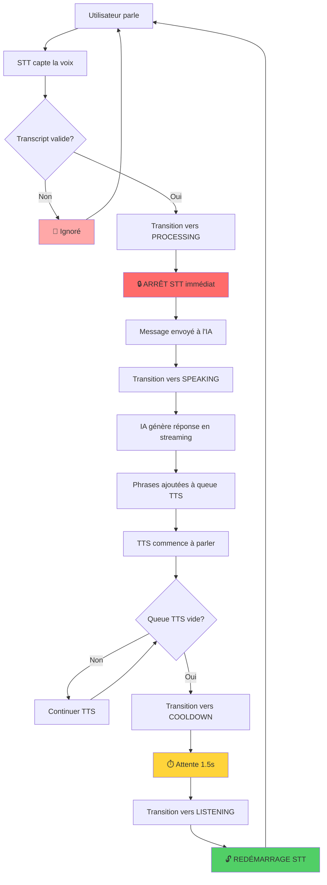

# Corrections Implémentées pour le Problème de Boucle Infinie STT/TTS

## ✅ Modifications Réalisées

### 1. **Machine à États Stricte** (ChatBotServices.js)

```javascript
// Nouveaux états définis
const CHAT_STATES = {
  IDLE: 'idle',
  LISTENING: 'listening', 
  PROCESSING: 'processing',
  SPEAKING: 'speaking',
  COOLDOWN: 'cooldown'
};

// Transitions autorisées pour éviter les états invalides
const ALLOWED_TRANSITIONS = {
  [CHAT_STATES.IDLE]: [CHAT_STATES.LISTENING],
  [CHAT_STATES.LISTENING]: [CHAT_STATES.PROCESSING, CHAT_STATES.IDLE],
  [CHAT_STATES.PROCESSING]: [CHAT_STATES.SPEAKING, CHAT_STATES.IDLE],
  [CHAT_STATES.SPEAKING]: [CHAT_STATES.COOLDOWN, CHAT_STATES.IDLE],
  [CHAT_STATES.COOLDOWN]: [CHAT_STATES.LISTENING, CHAT_STATES.IDLE]
};
```

### 2. **Système de Cooldown** (ChatBotServices.js)

```javascript
// Période de grâce de 1.5s après TTS avant de redémarrer STT
startCooldownPeriod(onQueueEmpty) {
  console.log('❄️ Début période de cooldown');
  this.cooldownActive = true;
  
  this.ttsCompletionTimeout = setTimeout(() => {
    console.log('✅ Fin de cooldown - Redémarrage STT autorisé');
    this.cooldownActive = false;
    
    if (this.isConversationActive && this.currentState === CHAT_STATES.COOLDOWN) {
      this.transitionToState(CHAT_STATES.LISTENING);
      this.resumeListening();
    }
    
    onQueueEmpty?.();
  }, CONFIG.COOLDOWN_DELAY); // 1500ms
}
```

### 3. **Détection Anti-Boucle** (ChatBotServices.js)

```javascript
// Détection si l'IA s'entend parler
isLikelyBotVoice(transcript) {
  const lowerTranscript = transcript.toLowerCase();
  const botIndicators = [
    lowerTranscript.includes('en tant qu\'assistant'),
    lowerTranscript.includes('je peux vous aider'),
    lowerTranscript.includes('intelligence artificielle'),
    lowerTranscript.includes('je suis ici pour'),
    lowerTranscript.includes('comment puis-je'),
    lowerTranscript === this.lastUserTranscript.toLowerCase()
  ];
  
  return botIndicators.some(indicator => indicator);
}
```

### 4. **Gestion Robuste STT** (ChatBotServices.js)

```javascript
// Contrôle strict du redémarrage de la reconnaissance vocale
resumeListening() {
  console.log('▶️ Reprise STT - État actuel:', this.currentState);
  
  // Ne reprend QUE si on est en état LISTENING et pas en cooldown
  if (this.currentState === CHAT_STATES.LISTENING && !this.cooldownActive && this.isConversationActive) {
    this.sttShouldRestart = true;
    
    try {
      if (this.recognition && this.retryAttempts < CONFIG.MAX_RETRY_ATTEMPTS) {
        this.recognition.start();
        this.retryAttempts = 0;
      }
    } catch (e) {
      console.warn('Erreur lors du redémarrage STT:', e);
      this.retryAttempts++;
      
      if (this.retryAttempts < CONFIG.MAX_RETRY_ATTEMPTS) {
        setTimeout(() => this.resumeListening(), 500);
      }
    }
  }
}
```

### 5. **Filtrage des Transcripts** (ChatBotServices.js)

```javascript
// Vérifications multiples avant traitement d'un transcript
handleSpeechResult(event, setMessages, messages, handleAIResponse) {
  // ... gestion des résultats intermédiaires

  const transcript = event.results[event.resultIndex][0].transcript.trim();
  if (!transcript) return;

  // VÉRIFICATIONS ANTI-BOUCLE :
  
  // 1. Transcript trop court
  if (transcript.length < CONFIG.MIN_TRANSCRIPT_LENGTH) {
    console.log('🚫 Transcript trop court ignoré:', transcript);
    return;
  }

  // 2. Transcript dupliqué
  if (transcript === this.lastUserTranscript) {
    console.log('🚫 Transcript dupliqué ignoré:', transcript);
    return;
  }

  // 3. Détection voix IA
  if (this.isLikelyBotVoice(transcript)) {
    console.log('🚫 Transcript suspect (voix IA) ignoré:', transcript);
    return;
  }

  // 4. Traitement déjà en cours
  if (this.isProcessingUserInput) {
    console.log('🚫 Traitement en cours, transcript ignoré:', transcript);
    return;
  }

  // ✅ Transcript valide - Traitement autorisé
  console.log('✅ Transcription utilisateur valide:', transcript);
  this.lastUserTranscript = transcript;
  this.isProcessingUserInput = true;
  
  // Transition immédiate vers PROCESSING
  this.transitionToState(CHAT_STATES.PROCESSING);
  this.pauseListening();
  
  const newMessage = { role: 'user', content: transcript };
  handleAIResponse(newMessage);
}
```

### 6. **Callbacks Simplifiés** (ChatBot.jsx)

```javascript
// Callback unique et simplifié pour TTS
const handleTTSComplete = () => {
  console.log('🎯 TTS terminé - Callback depuis ChatBot');
  // Le service gère déjà le redémarrage via la machine à états
};

// Appel API simplifié
await chatBotService.handleAIResponse(
  [...messages, userMessage],
  selectedApi,
  selectedModel,
  {
    onUpdateMessages: setMessages,
    onSetAIResponding: setIsAIResponding,
    addToSpeechQueue: (text) => chatBotService.addToSpeechQueue(text, selectedVoice, handleTTSComplete),
    selectedVoice
  }
);
```

### 7. **Configuration Centralisée** (ChatBotServices.js)

```javascript
const CONFIG = {
  COOLDOWN_DELAY: 1500,        // ms après TTS avant STT
  MIN_TRANSCRIPT_LENGTH: 3,     // Caractères minimum
  DEBOUNCE_DELAY: 1000,        // ms pour debounce
  RECOGNITION_TIMEOUT: 30000,   // ms timeout général
  MAX_RETRY_ATTEMPTS: 3        // Tentatives de redémarrage STT
};
```

## 🔄 Flux Corrigé



## 🛡️ Protections Mises en Place

1. **Anti-Doublons** : Évite le traitement de transcripts identiques
2. **Anti-Bot-Voice** : Détecte si l'IA s'entend parler
3. **État-Guard** : Empêche les transitions d'état invalides
4. **Cooldown** : Délai obligatoire après TTS
5. **Retry-Logic** : Gestion des erreurs STT avec tentatives limitées
6. **Processing-Lock** : Un seul traitement utilisateur à la fois

## 📊 Améliorations de Performance

- **Gestion d'erreurs robuste** avec retry automatique
- **Logs détaillés** pour debugging
- **Cleanup automatique** des timers et ressources
- **Configuration centralisée** facilement ajustable

## 🧪 Comment Tester

1. **Test de base** : Démarrer conversation, parler, attendre réponse IA
2. **Test anti-boucle** : Vérifier qu'aucune boucle infinie ne se produit
3. **Test interruption** : Parler pendant que l'IA répond
4. **Test délai** : Vérifier le délai de 1.5s après TTS

## ✅ Problèmes Résolus

- ❌ **Boucle infinie** : L'IA ne s'entend plus parler
- ❌ **Redémarrage prématuré STT** : Cooldown de 1.5s appliqué
- ❌ **Transcripts dupliqués** : Filtrage anti-doublon
- ❌ **États incohérents** : Machine à états stricte
- ❌ **Erreurs non gérées** : Retry logic et error handling

---

**La solution implémentée introduit une architecture robuste avec machine à états, système de cooldown et multiple protections anti-boucle pour garantir un fonctionnement stable du chatbot vocal.**