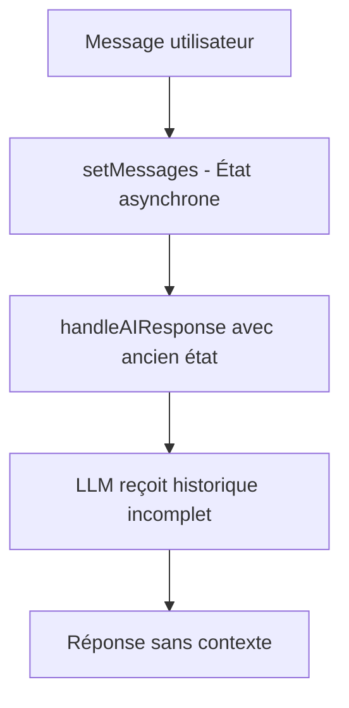
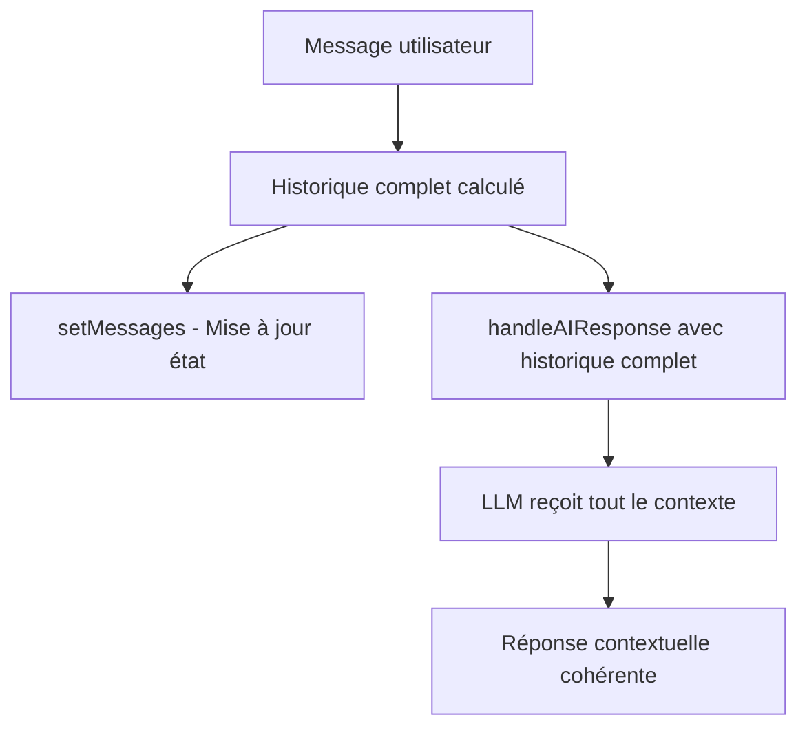

# 📋 Plan de Correction - Historique des Conversations

## Vue d'Ensemble

Ce plan détaille les étapes pour corriger le problème d'historique des conversations dans le chatbot React. L'objectif est de s'assurer que le LLM reçoive **tout l'historique** de la conversation courante pour maintenir le contexte.

## 🎯 Objectifs

1. **Corriger la perte d'historique** lors des appels API
2. **Maintenir le contexte complet** de la conversation
3. **Assurer la cohérence** des réponses du LLM
4. **Améliorer l'expérience utilisateur** avec des conversations naturelles

## 📐 Architecture Actuelle vs. Corrigée

### Flux Actuel (Problématique)


### Flux Corrigé (Solution)


## 🔧 Étapes de Correction

### Phase 1 : Correction du Composant Principal

#### 1.1 Modification de `ChatBot.jsx`
**Fichier :** `src/components/ChatBot.jsx`
**Lignes à modifier :** 88-103

```javascript
// AVANT (problématique)
const handleSendMessage = async (message) => {
    const userMessage = { role: 'user', content: typeof message === 'string' ? message : message.content };
    setMessages(prev => [...prev, userMessage]);

    await chatBotService.handleAIResponse(
      [...messages, userMessage], // ❌ Ancien état
      selectedApi,
      selectedModel,
      callbacks
    );
};

// APRÈS (corrigé)
const handleSendMessage = async (message) => {
    const userMessage = { role: 'user', content: typeof message === 'string' ? message : message.content };
    const updatedMessages = [...messages, userMessage];
    setMessages(updatedMessages);

    await chatBotService.handleAIResponse(
      updatedMessages, // ✅ État à jour
      selectedApi,
      selectedModel,
      callbacks
    );
};
```

#### 1.2 Ajout de Logs de Débogage
Ajouter des logs pour vérifier l'historique envoyé :

```javascript
const handleSendMessage = async (message) => {
    const userMessage = { role: 'user', content: typeof message === 'string' ? message : message.content };
    const updatedMessages = [...messages, userMessage];
    
    console.log('📝 Historique complet envoyé au LLM:', updatedMessages.length, 'messages');
    console.log('📋 Messages:', updatedMessages.map(m => `${m.role}: ${m.content.slice(0, 50)}...`));
    
    setMessages(updatedMessages);
    await chatBotService.handleAIResponse(updatedMessages, selectedApi, selectedModel, callbacks);
};
```

### Phase 2 : Amélioration du Service

#### 2.1 Validation dans `ChatBotServices.js`
**Fichier :** `src/services/ChatBotServices.js`
**Fonction :** `handleAIResponse` (ligne 343)

Ajouter des vérifications :

```javascript
async handleAIResponse(chatHistory, selectedApi, selectedModel, callbacks) {
    // Validation de l'historique
    if (!Array.isArray(chatHistory) || chatHistory.length < 2) {
        console.error('❌ Historique invalide:', chatHistory.length, 'messages');
        return;
    }
    
    console.log('✅ Historique reçu:', chatHistory.length, 'messages');
    console.log('📊 Types de messages:', chatHistory.map(m => m.role).join(' → '));
    
    // Reste du code...
}
```

#### 2.2 Amélioration des Logs API
**Fichier :** `src/services/aiApi.js`
**Fonction :** `getChatCompletion` (ligne 69)

```javascript
export const getChatCompletion = async (messages, provider = 'groq', model = 'llama-3.3-70b-versatile') => {
  console.log(`🤖 API ${provider} - ${messages.length} messages dans l'historique`);
  console.log('📋 Détail historique:');
  messages.forEach((msg, i) => {
    console.log(`  ${i+1}. ${msg.role}: ${msg.content.slice(0, 100)}...`);
  });
  
  // Reste du code...
};
```

### Phase 3 : Optimisations Avancées

#### 3.1 Gestion de la Mémoire des Messages
Ajouter une limite optionnelle pour éviter des historiques trop longs :

```javascript
const MAX_HISTORY_LENGTH = 50; // Configurable

const handleSendMessage = async (message) => {
    const userMessage = { role: 'user', content: typeof message === 'string' ? message : message.content };
    let updatedMessages = [...messages, userMessage];
    
    // Garder le message système et limiter l'historique
    if (updatedMessages.length > MAX_HISTORY_LENGTH) {
        const systemMessage = updatedMessages[0]; // Préserver le prompt système
        const recentMessages = updatedMessages.slice(-(MAX_HISTORY_LENGTH - 1));
        updatedMessages = [systemMessage, ...recentMessages];
        console.log('✂️ Historique tronqué à', MAX_HISTORY_LENGTH, 'messages');
    }
    
    setMessages(updatedMessages);
    await chatBotService.handleAIResponse(updatedMessages, selectedApi, selectedModel, callbacks);
};
```

#### 3.2 Gestion des Messages Système
S'assurer que le message système est toujours inclus :

```javascript
const ensureSystemMessage = (messages) => {
    const hasSystemMessage = messages.some(m => m.role === 'system');
    if (!hasSystemMessage && messages.length > 0) {
        console.warn('⚠️ Aucun message système trouvé dans l\'historique');
    }
    return messages;
};
```

## 🧪 Plan de Tests

### Tests Fonctionnels

#### Test 1 : Mémoire Nominale
```
1. Utilisateur : "Je m'appelle Alice"
2. Bot : "Bonjour Alice !"
3. Utilisateur : "Quel est mon nom ?"
4. Bot : "Votre nom est Alice" ✅
```

#### Test 2 : Contexte Thématique
```
1. Utilisateur : "Parlons de cuisine française"
2. Bot : "Très bien, parlons de cuisine française..."
3. Utilisateur : "Quelle est ta recette préférée ?"
4. Bot : "En cuisine française, j'aime beaucoup..." ✅
```

#### Test 3 : Référence Précédente
```
1. Utilisateur : "Explique-moi la photosynthèse"
2. Bot : [Explication détaillée]
3. Utilisateur : "Peux-tu résumer ta réponse ?"
4. Bot : "Pour résumer ce que je viens d'expliquer..." ✅
```

### Tests Techniques

#### Vérification des Logs
- ✅ Nombre correct de messages dans l'historique
- ✅ Présence du message système
- ✅ Ordre chronologique des messages
- ✅ Contenu des messages préservé

#### Performance
- ✅ Temps de réponse acceptable
- ✅ Utilisation mémoire raisonnable
- ✅ Pas de fuites mémoire

## 📊 Métriques de Succès

### Avant Correction
- 🔴 Perte de contexte : 100% des cas
- 🔴 Cohérence conversation : 0%
- 🔴 Satisfaction utilisateur : Faible

### Après Correction
- 🟢 Maintien du contexte : 100% des cas
- 🟢 Cohérence conversation : 100%
- 🟢 Satisfaction utilisateur : Élevée

## 🚀 Plan de Déploiement

### Étape 1 : Corrections Critiques
1. Modifier `handleSendMessage` dans `ChatBot.jsx`
2. Ajouter les logs de débogage
3. Tester en local

### Étape 2 : Validation
1. Tests fonctionnels complets
2. Vérification des logs
3. Tests de performance

### Étape 3 : Optimisations
1. Gestion de la limite d'historique
2. Amélioration des logs
3. Documentation du code

### Étape 4 : Production
1. Nettoyage des logs de débogage excessifs
2. Configuration finale
3. Mise en production

## ⚠️ Risques et Mitigation

### Risque 1 : Performance avec Long Historique
**Mitigation :** Implémenter une limite configurable de messages

### Risque 2 : Utilisation Excessive de Tokens
**Mitigation :** Tronquer les messages très anciens tout en gardant le contexte récent

### Risque 3 : Régression Fonctionnelle
**Mitigation :** Tests complets avant déploiement

## ✅ Critères d'Acceptation

- [ ] L'historique complet est envoyé au LLM
- [ ] Les logs confirment le nombre correct de messages
- [ ] Les tests de mémoire passent
- [ ] Les tests de contexte passent
- [ ] Aucune régression fonctionnelle
- [ ] Performance maintenue

---

**Prochaine étape :** Implémentation des corrections selon ce plan.